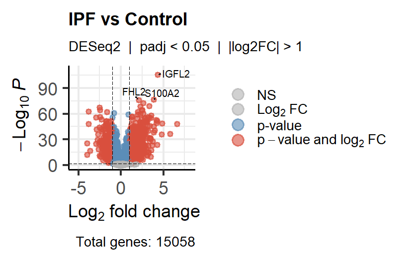
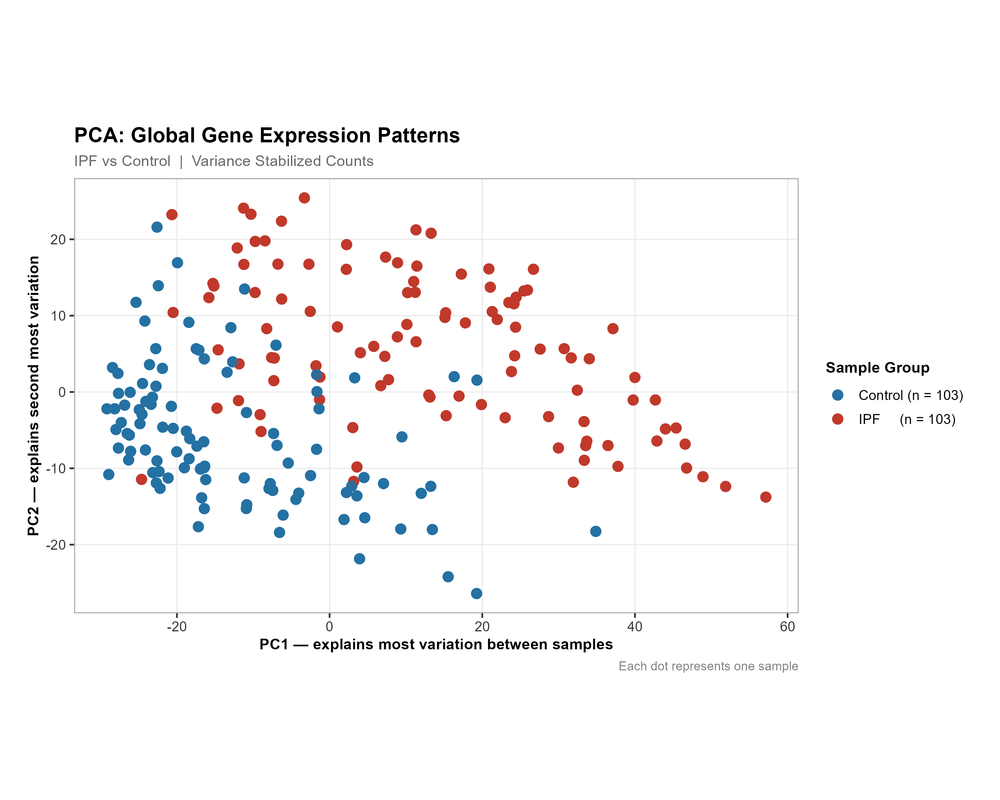
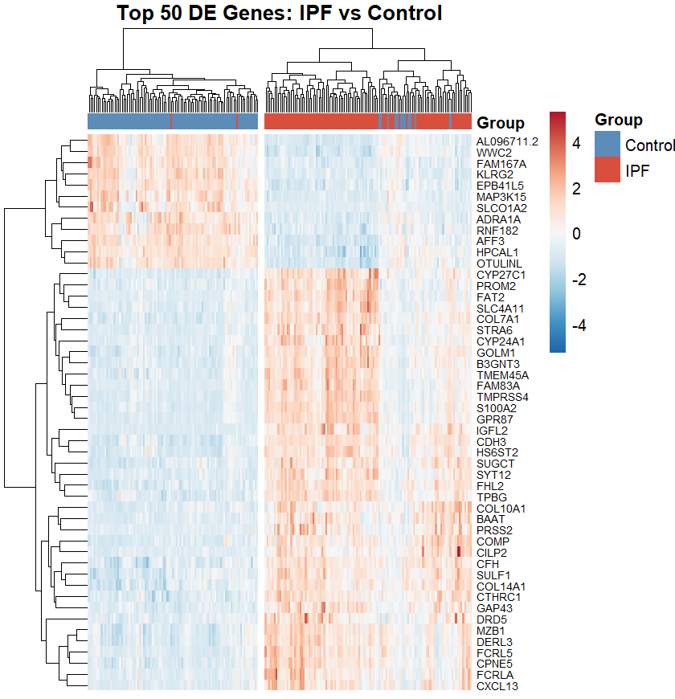
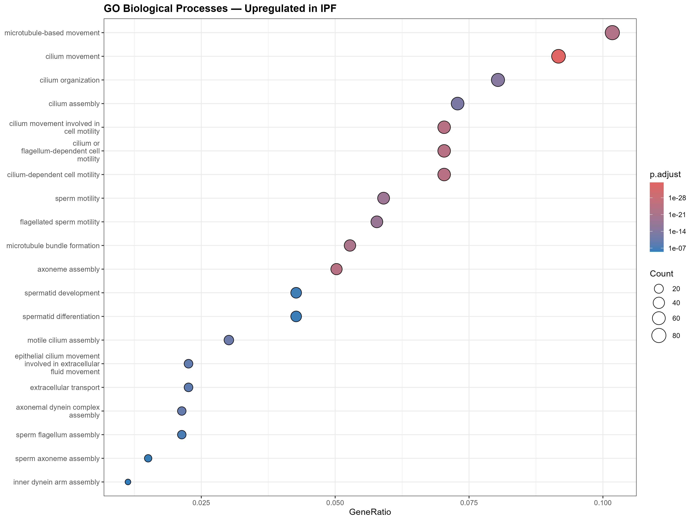
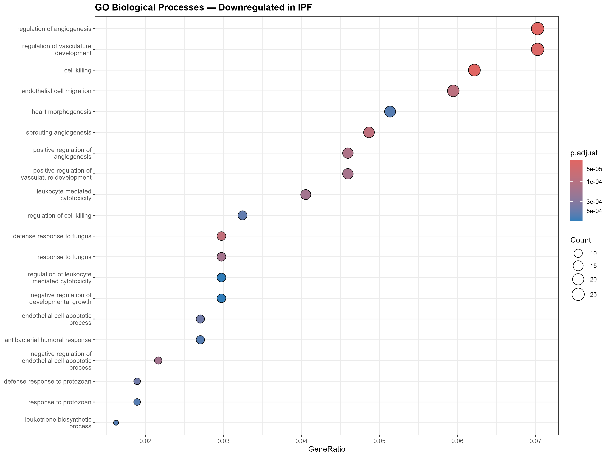

# ipf-rnaseq-analysis
RNA-seq Differential Expression Analysis: Idiopathic Pulmonary Fibrosis vs. Healthy Lung tissue
A end-to-end RNA-seq pipeline analyzing gene expression differences in IPF lung tissue using a public GEO dataset (GSE150910). The project spans raw count preprocessing in Python through DESeq2 differential expression modeling and pathway enrichment analysis in R.

---

## Biological Background

Idiopathic pulmonary fibrosis (IPF) is a progressive and fatal lung disease characterized by excessive scarring of lung tissue. The molecular mechanisms driving fibrosis — including dysregulated collagen remodeling, epithelial-mesenchymal transition, and aberrant immune signaling — remain incompletely understood. This project uses bulk RNA-seq data to identify transcriptional signatures distinguishing IPF lung tissue from healthy controls.

---

## Dataset

- **Source:** NCBI GEO — [GSE150910](https://www.ncbi.nlm.nih.gov/geo/query/acc.cgi?acc=GSE150910)
- **Samples:** IPF lung tissue vs. healthy control lung tissue
- **Data type:** Raw RNA-seq count matrix

---

## Pipeline Overview

```
Raw counts (GEO)
      │
      ▼
[Python] Preprocessing & QC
  - Sample metadata parsing
  - Low-count gene filtering
  - Count normalization (CPM)
      │
      ▼  (CSV export)
      │
      ▼
[R / DESeq2] Differential Expression
  - DESeq2 modeling (IPF vs. Control)
  - Shrinkage estimation (apeglm)
  - Significance filtering (padj < 0.05, |log2FC| > 1)
      │
      ├──▶ [R / clusterProfiler] Pathway Enrichment
      │       - Gene Ontology (BP, MF, CC)
      │       - KEGG pathway analysis
      │
      └──▶ [R] Visualizations
              - Volcano plot (EnhancedVolcano)
              - PCA plot
              - Heatmap (pheatmap)
              - Dotplot / barplot (clusterProfiler)
```

---

## Key Findings

- Identified **[N] significantly differentially expressed genes** (padj < 0.05, |log2FC| > 1)
- **Upregulated in IPF:** Collagen remodeling genes (e.g., *COL1A1*, *COL3A1*), fibrosis-associated TGF-β pathway components
- **Downregulated in IPF:** Cilium/microtubule assembly genes, surfactant-related transcripts
- Enriched GO biological processes: **extracellular matrix organization**, **collagen fibril organization**, **cilium assembly**
- KEGG pathways: **ECM-receptor interaction**, **TGF-β signaling**, **focal adhesion**

> Replace bracketed placeholders with your actual numbers and gene hits before publishing.

---

## Repository Structure

```
.
├── data/
│   └── GSE150910_counts.csv          # Raw count matrix (not tracked if large)
├── python/
│   ├── 01_preprocessing.py           # Metadata parsing, filtering, normalization
│   └── normalized_counts.csv         # CPM-normalized counts exported for R
├── R/
│   ├── 02_deseq2_analysis.R          # DESeq2 modeling and results export
│   ├── 03_visualization.R            # Volcano, PCA, heatmap
│   └── 04_pathway_enrichment.R       # clusterProfiler GO/KEGG analysis
├── results/
│   ├── deseq2_results.csv            # Full DESeq2 output
│   ├── significant_genes.csv         # Filtered DEGs
│   └── figures/                      # All plots (PNG/PDF)
└── README.md
```

---

## Tools & Environment

| Component | Tool / Package |
|-----------|---------------|
| Language (preprocessing) | Python 3.x |
| Language (modeling) | R 4.x |
| Differential expression | DESeq2 |
| Pathway enrichment | clusterProfiler |
| Visualization | ggplot2, EnhancedVolcano, pheatmap, ggrepel |
| Data source | GEOquery / manual download |

---

## How to Reproduce

### Python (preprocessing)

```bash
pip install pandas numpy matplotlib seaborn
python python/01_preprocessing.py
```

### R (DESeq2 + enrichment)

```r
# Install required packages (run once)
if (!requireNamespace("BiocManager", quietly = TRUE)) install.packages("BiocManager")
BiocManager::install(c("DESeq2", "clusterProfiler", "EnhancedVolcano", "org.Hs.eg.db", "apeglm"))
install.packages(c("pheatmap", "ggrepel", "ggplot2"))

# Then run scripts in order
source("R/02_deseq2_analysis.R")
source("R/03_visualization.R")
source("R/04_pathway_enrichment.R")
```

---

## Selected Figures

### Volcano Plot


### PCA Plot


### Heatmap


### GO Enrichment — Upregulated Genes


### GO Enrichment — Downregulated Genes


---

## Biological Interpretation

The transcriptomic profile of IPF lung tissue is dominated by signatures of excessive extracellular matrix (ECM) deposition and impaired mucociliary function. The upregulation of fibrillar collagens (*COL1A1*, *COL3A1*) and ECM-receptor interaction pathways is consistent with established fibrotic remodeling in IPF. Conversely, downregulation of cilium assembly genes reflects loss of normal airway epithelial identity — a hallmark of IPF disease progression.

---

## Author

**Ashwitha Radhakrishnan Iyer**  
MSc Bioinformatics 
[LinkedIn](https://www.linkedin.com/in/ashwitha-iyer-a7984a190) 

---

## License
This project is for educational and portfolio purposes. The dataset (GSE150910) is publicly available via NCBI GEO under its respective data use terms.
